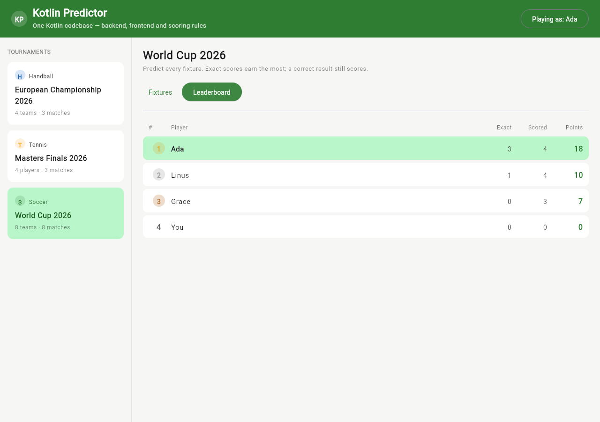

# Kotlin Full-Stack Sports Predictor

[](https://github.com/ivan2311/kotlin-full-stack/actions/workflows/ci.yml)

A tournament prediction game — pick the scores, earn points, climb the leaderboard —
built to demonstrate one idea: **you can be a full-stack developer using only Kotlin.**
The backend, the frontend, and the business logic they *share* are all Kotlin, in one
Gradle build, with the domain model and scoring rules written exactly once.

It ships with three sports out of the box — **soccer** (a World Cup), **tennis** (a
knockout), and **handball** (a championship) — to show the model is genuinely
sport-agnostic rather than a soccer app with hardcoded assumptions.

```
┌──────────────────────────────────────────────────────────────┐
│                        :shared  (Kotlin)                       │
│   domain model · scoring engine · leaderboard · API contract   │
│         compiles to  →  JVM   and   →  WebAssembly             │
└───────────────┬──────────────────────────────┬────────────────┘
                │ JVM                           │ Wasm
        ┌───────▼────────┐             ┌────────▼─────────┐
        │    :server     │   REST/JSON │      :web        │
        │  Ktor (Netty)  │◄───────────►│ Compose (Wasm)   │
        │  in-memory DB  │             │  browser UI      │
        └────────────────┘             └──────────────────┘
```

## Screenshots

The frontend is Jetpack Compose compiled to WebAssembly — no HTML/JS hand-written.

| Fixtures & live scoring | Leaderboard |
|---|---|
|  |  |

The green `+5 · Exact score` pills on the fixtures screen are computed **in the browser by
the shared `PredictionScorer`** — the very same function the server uses to build the
leaderboard on the right.

## Why this is interesting

The `:shared` module is the whole point. The `PredictionScorer` — the rule that turns
"you predicted 2–1, it finished 3–2" into points — is written once and runs in **two
places without modification**:

- on the **server**, as the authority that computes the official leaderboard, and
- in the **browser**, so the UI shows the points you earned the instant a result lands,
  with zero chance of the two disagreeing.

The REST contract (`ApiRoutes` + the request/response types) also lives in `:shared`, so
the client and server are checked against a single source of truth by the same compiler.
There is no hand-copied API spec that can drift.

## Project layout

| Module    | Target        | What it is                                                        |
|-----------|---------------|-------------------------------------------------------------------|
| `shared`  | JVM + Wasm    | Domain model, scoring engine, leaderboard calculator, API contract |
| `server`  | JVM           | Ktor backend: REST API + in-memory store, also serves the web app  |
| `web`     | Wasm          | Compose Multiplatform UI compiled to WebAssembly                   |

Key files to read first:

- `shared/.../scoring/PredictionScorer.kt` — the shared rule, the heart of the demo
- `shared/.../model/Sport.kt` — how a new sport is added in one place
- `shared/.../api/ApiContract.kt` — the one true API definition
- `server/.../plugins/Routing.kt` — the HTTP surface
- `web/.../App.kt` + `Fixtures.kt` — the Compose UI (and the scorer running client-side)

## Running it

Requirements: JDK 17+ (this repo is built with JDK 21). The Gradle wrapper handles
everything else — Kotlin, Compose, the Wasm toolchain, Node.

**One command, both tiers on one origin:**

```bash
# 1. Build the WebAssembly frontend
./gradlew :web:wasmJsBrowserDistribution

# 2. Start the server — it serves the API *and* the compiled frontend
./gradlew :server:run
```

Then open <http://localhost:8080>. The server detects the built frontend in
`web/build/dist/wasmJs/...` and hosts it at `/`, with the API under `/api`.

**Frontend hot-reload during development** (served by the webpack dev server instead):

```bash
./gradlew :web:wasmJsBrowserDevelopmentRun --continuous
```

### Tests

```bash
./gradlew test          # all modules
./gradlew :shared:jvmTest   # the scoring engine + leaderboard unit tests
./gradlew :server:test      # the REST API integration tests
```

## The API

| Method | Path                                          | Returns                     |
|--------|-----------------------------------------------|-----------------------------|
| GET    | `/api/tournaments`                            | `List<TournamentSummary>`   |
| GET    | `/api/tournaments/{id}`                        | `Tournament`                |
| GET    | `/api/tournaments/{id}/matches?userId=`        | `List<MatchView>`           |
| GET    | `/api/tournaments/{id}/leaderboard`            | `Leaderboard`               |
| GET    | `/api/users`                                   | `List<User>`                |
| GET    | `/api/predictions?userId=&tournamentId=`       | `List<Prediction>`          |
| POST   | `/api/predictions`                             | `PredictionResponse`        |

All payloads are the `@Serializable` types from `:shared`.

## Scoring

| Outcome                                   | Soccer / Handball | Tennis |
|-------------------------------------------|-------------------|--------|
| Exact score                               | 5                 | 4      |
| Right result **and** margin (wrong score) | 3                 | 3      |
| Right result only                         | 2                 | 2      |
| Wrong result                              | 0                 | 0      |

The weights are data (`ScoringRules`), attached to each `Sport`. Adding a sport is a
one-line enum entry — no `when (sport)` branches to hunt down.

## Adding a new sport

1. Add an entry to the `Sport` enum with its vocabulary and a `ScoringRules` preset.
2. Add some seed data for it in `server/.../data/SeedData.kt`.

That's it. The API, the scoring engine, and the Compose UI all read those properties, so
nothing else needs to change.

## Status / next steps

This is a first vertical slice. Natural follow-ups: real persistence (Exposed + a
database behind the same `PredictionStore` interface), authentication, live score
ingestion from a real feed, and knockout-bracket progression. See
[`article/`](article/) for the full write-up.

---

Built as a demonstration of full-stack Kotlin with Kotlin Multiplatform, Ktor, and
Compose Multiplatform.
