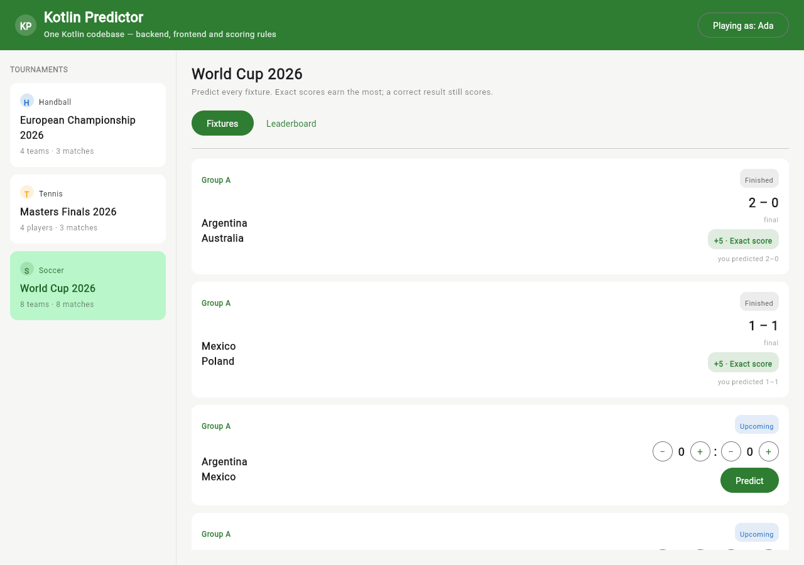

# Full stack 'Android' dev: One Compose UI — Android, iOS, and the web

*Part 4 of a series building a multi-sport tournament predictor entirely in Kotlin. The
finale: one Compose Multiplatform UI, running natively on Android and iOS — and, as a
bonus, in the browser.*

> **Full stack 'Android' dev** — a series:
> 1. [The idea — one language, every screen](01-the-idea.md)
> 2. [The shared module — write the rules once](02-the-shared-module.md)
> 3. [The Ktor backend — a JVM server that speaks your model](03-the-ktor-backend.md)
> 4. **One Compose UI — Android, iOS, and the web** *(you are here)*

---

We have a shared module ([Part 2](02-the-shared-module.md)) and a Ktor backend serving it
([Part 3](03-the-ktor-backend.md)). Time for the screens.

Here's the part that still makes people blink: the UI is written in **Jetpack Compose** —
the same `@Composable` functions Android developers already write every day — and, through
**Compose Multiplatform**, that same code runs on **iOS** as a native binary and in the
**browser** as WebAssembly. No SwiftUI. No React. No JSX. Kotlin, all the way to every
pixel.

This is the literal answer to the series' title. An "Android dev" writes Compose. Compose
now runs everywhere. So the Android dev's UI skills *are* full-stack UI skills.



*(The screenshot above is the web target — the same composables render identically on an
Android device and an iOS simulator.)*

---

## The same entry point, three platforms

A Compose Multiplatform app factors into a shared `App()` composable plus a tiny
per-platform launcher. The `App()` is written once, in common code:

```kotlin
@Composable
fun App() {
    val scope = rememberCoroutineScope()
    val vm = remember { AppViewModel(ApiClient(), scope) }
    LaunchedEffect(Unit) { vm.start() }

    PredictorTheme {
        Surface(Modifier.fillMaxSize(), color = MaterialTheme.colorScheme.background) {
            Column(Modifier.fillMaxSize()) {
                HeaderBar(vm)
                vm.error?.let { ErrorBanner(it) }
                Row(Modifier.fillMaxSize()) {
                    TournamentRail(vm, Modifier.width(280.dp))
                    DetailPane(vm, Modifier.weight(1f))
                }
            }
        }
    }
}
```

Each platform just hands `App()` a window to draw into:

```kotlin
// web  (wasmJsMain)
fun main() = ComposeViewport(document.body!!) { App() }

// android  (androidMain)
class MainActivity : ComponentActivity() {
    override fun onCreate(b: Bundle?) { super.onCreate(b); setContent { App() } }
}

// ios  (iosMain) — called from Swift's UIViewController
fun MainViewController(): UIViewController = ComposeUIViewController { App() }
```

Three launchers, a handful of lines each. Every screen, every layout, every piece of state
below `App()` is shared.

> The reference repo ships all three launchers: `ComposeViewport` for web, `MainActivity`
> for Android, and `MainViewController` for iOS (with a thin Swift shell under `iosApp/`).
> The shared UI — `App()` and everything below it — lives in `commonMain`; each target
> adds only its launcher, its Ktor engine, and its base URL. Adding the two mobile
> platforms touched **not a single composable**, because the composables never assumed a
> platform.

---

## State in a plain view model, no framework required

Compose's snapshot state makes an ordinary Kotlin class fully reactive. Assign to a
property and every composable that read it recomposes:

```kotlin
class AppViewModel(private val api: ApiClient, private val scope: CoroutineScope) {
    var tournaments by mutableStateOf<List<TournamentSummary>>(emptyList()); private set
    var matchViews by mutableStateOf<List<MatchView>>(emptyList());          private set
    var leaderboard by mutableStateOf<Leaderboard?>(null);                   private set
    var loading by mutableStateOf(false);                                    private set

    fun start() = scope.launch {
        tournaments = api.tournaments()
        tournaments.firstOrNull()?.let { select(it.id) }
    }

    fun savePrediction(matchId: String, outcome: MatchOutcome) = scope.launch {
        api.submitPrediction(SubmitPredictionRequest(currentUserId, matchId, outcome))
        refreshDetail()
    }
}
```

The types are the shared ones — `TournamentSummary`, `MatchView`, `Leaderboard`,
`MatchOutcome` — used directly as UI state. There is no separate "client model" layer.

---

## The HTTP client returns shared types, not mirrors of them

Look at what the Ktor client's methods return:

```kotlin
class ApiClient(private val baseUrl: String = /* platform default */) {
    private val http = HttpClient { install(ContentNegotiation) { json(Json { ignoreUnknownKeys = true }) } }

    suspend fun tournaments(): List<TournamentSummary> =
        http.get(url(ApiRoutes.TOURNAMENTS)).body()

    suspend fun leaderboard(tournamentId: String): Leaderboard =
        http.get(url(ApiRoutes.leaderboard(tournamentId))).body()

    suspend fun submitPrediction(request: SubmitPredictionRequest): PredictionResponse =
        http.post(url(ApiRoutes.PREDICTIONS)) {
            contentType(ContentType.Application.Json); setBody(request)
        }.body()
}
```

`Leaderboard`. `TournamentSummary`. The *shared* types — the actual classes the server
serialized, not a hand-written interface that mirrors the server's JSON. `.body()`
deserializes straight into them. The client holds **no DTO definitions and no JSON field
names**; it calls `ApiRoutes` paths and receives shared model types, so client and server
are type-checked against one contract by one compiler.

Ktor's client is itself multiplatform — the same call runs on OkHttp under Android, Darwin
under iOS, and the browser's `fetch` under Wasm. Only the base URL differs per platform.

---

## The payoff, made visible: the shared scorer runs on-device

Here is the whole thesis rendered as a UI pill. When a match is finished, the client scores
your prediction *locally* — using the very same `PredictionScorer` the backend uses for the
official leaderboard:

```kotlin
@Composable
private fun FinishedPanel(view: MatchView, sport: Sport) {
    val actual = view.match.actualOutcome!!
    val earned = view.prediction?.let {
        // The SAME PredictionScorer the backend uses — here it's running on the device.
        PredictionScorer.score(it, actual, sport.scoringRules)
    }
    if (earned != null) PointsPill(earned)   // e.g. "+5 · Exact score"
}
```

No round-trip to score a result the device already has. No chance of the client's "+5"
disagreeing with the server's, because it is the same function compiled for this target.
That one function — `PredictionScorer.score` — now runs as JVM bytecode on the server, on
the Android runtime, as a native iOS binary, and as WebAssembly in the browser, all from a
single source, producing identical results by construction.

The UI also reads sport behavior straight from the shared model — no `when (sport)` here
either:

```kotlin
val drawBlocked = isDraw && !sport.allowsDraw          // disable submit for an illegal tennis draw
Text(sport.scoreUnit)                                  // "Goals" or "Sets" column label
Text("${summary.competitorCount} ${sport.competitorNoun.lowercase()}s")
```

Add cricket in the enum (Part 2) and this screen labels its scores "Runs" with no UI change.

---

## What differs per platform (and it's little)

Sharing the UI does not mean ignoring the platforms:

- **Navigation & window chrome** — an Android `Activity`, an iOS `UIViewController`, a
  browser viewport — is the per-platform launcher shown above.
- **Platform APIs** (secure storage, notifications, biometrics) are reached through
  Kotlin's `expect`/`actual` mechanism: declare the need in common code, implement it once
  per target.
- **Look and feel** — Compose Multiplatform renders Material with its own engine
  (Skia/Skiko), so the app looks consistent across platforms; lean into that rather than
  chasing pixel-identical native widgets.

Everything else — the screens, the state, the networking, the scoring — is the shared code
you've now seen.

---

## Try it

```bash
./gradlew :web:wasmJsBrowserDistribution   # build the Wasm frontend
./gradlew :server:run                       # serve API + frontend on :8080
```

Open <http://localhost:8080>, switch between players, predict the upcoming fixtures, and
watch the leaderboard react. Then imagine — accurately — that the identical screens are one
`androidTarget()` and one `iosArm64()` away from being two native apps.

---

## The series, in one line

An Android developer's toolkit — Kotlin, Compose, coroutines, Gradle — now reaches the
backend, the web, and both mobile platforms, sharing the domain model, the API contract,
and the scoring rule as *one* piece of code. That's the whole idea of **Full stack
'Android' dev**: you were closer to full-stack than the job title let on.

Start reading the source at `shared/scoring/PredictionScorer.kt` and follow it outward.
That one file runs everywhere, and that's the point.

---

> **Full stack 'Android' dev** — a series:
> [1. The idea](01-the-idea.md) ·
> [2. The shared module](02-the-shared-module.md) ·
> [3. The Ktor backend](03-the-ktor-backend.md) ·
> **4. One Compose UI**
